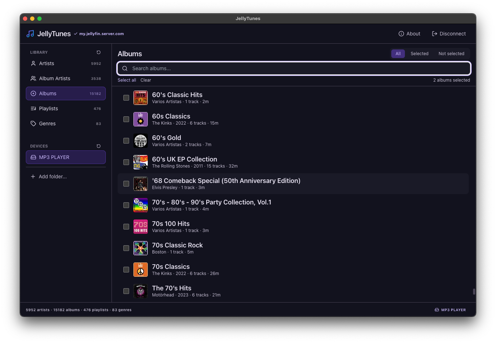
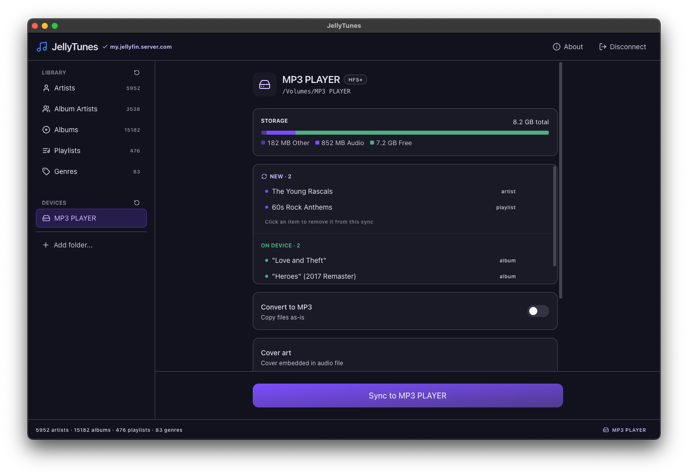
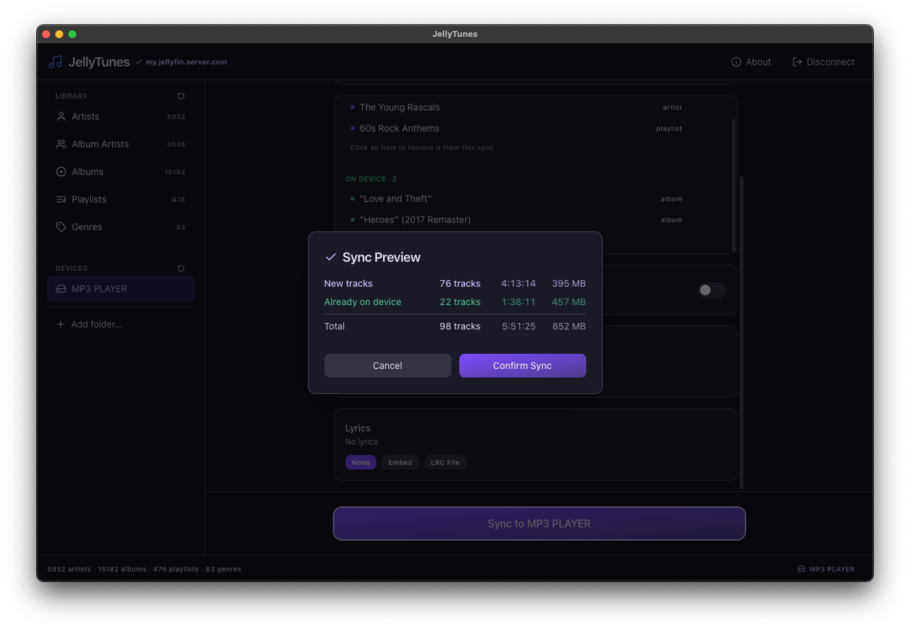
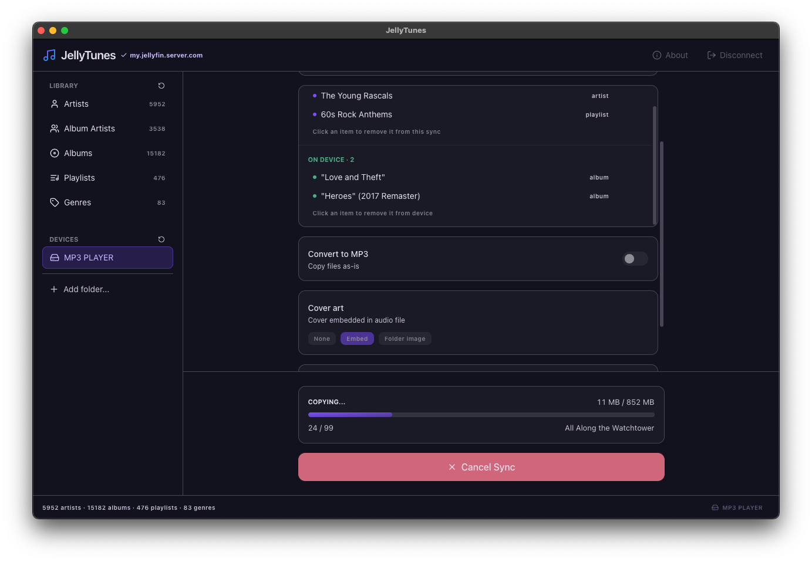

<p align="center">
  
</p>

<h1 align="center">JellyTunes</h1>

<p align="center">
  Sync your Jellyfin music library to any USB drive, SD card or local folder — with optional FLAC to MP3 conversion.
</p>

<p align="center">
  <a href="https://github.com/orainlabs/jellytunes/releases/latest"></a>
  &nbsp;
  <a href="https://www.gnu.org/licenses/gpl-3.0"></a>
</p>

<p align="center">
  <a href="https://ko-fi.com/orainlabs"></a>
</p>

---

JellyTunes is a desktop app for [Jellyfin](https://jellyfin.org) users who want to take their music offline. Browse your server's artists, album artists, albums, playlists, and genres, pick a destination — a USB drive, SD card, or any local folder — and hit sync. JellyTunes downloads everything, converts formats if needed, embeds lyrics and cover art, and mirrors your server's folder structure at the destination.

## Key Features

- **Browse your full library** — artists, album artists, albums, playlists, and genres pulled directly from your Jellyfin server
- **Sync anywhere** — USB drives, SD cards, and local folders all work as destinations
- **Selective sync** — only downloads what's new or changed; skips tracks already at the destination
- **Out-of-sync detection** — tracks that changed on the server since the last sync are automatically flagged for update
- **Sync preview** — a three-column breakdown of exactly what will be added, updated, or removed — with per-category track count, size, and duration — before you commit to a sync
- **FLAC to MP3 conversion** — built-in FFmpeg support with configurable bitrate (128k / 192k / 320k); settings saved per device
- **Lyrics sync** — download `.lrc` sidecar files or embed lyrics directly into tracks (supports Jellyfin 10.9+ JSON lyrics); mode is configurable per device
- **Cover art modes** — embed cover art into each track or write companion `cover.jpg` files; chosen per device and persisted
- **ReplayGain tags** — ReplayGain metadata from Jellyfin is embedded into synced tracks for consistent playback volume
- **Smart storage bar** — visual capacity indicator with live size estimates; warns when your selection exceeds free space
- **Smart filesystem handling** — auto-detects FAT32, exFAT, and NTFS; sanitizes filenames accordingly
- **Per-destination history** — remembers what was synced to each device or folder so you can pick up where you left off
- **Cancel anytime** — stop a sync mid-progress without corrupting what's already been written

## Screenshots

<p align="center">
  <a href="assets/screenshot-albums.png"></a>
  &nbsp;&nbsp;
  <a href="assets/screenshot-device.png"></a>
</p>
<p align="center">
  <em>Browse your library &nbsp;·&nbsp; Pick a destination device or folder</em>
</p>

<p align="center">
  <a href="assets/screenshot-sync-preview.png"></a>
  &nbsp;&nbsp;
  <a href="assets/screenshot-syncing.png"></a>
</p>
<p align="center">
  <em>Review what will change &nbsp;·&nbsp; Sync with live, phase-aware progress</em>
</p>

## Installation

Download the latest release for your platform from [GitHub Releases](https://github.com/orainlabs/jellytunes/releases):

| Platform | File                  |
| -------- | --------------------- |
| macOS    | `.dmg`                |
| Windows  | `.exe` installer      |
| Linux    | `.AppImage` or `.deb` |

Open the installer and follow the prompts. No additional setup is required — FFmpeg is bundled with the app.

### macOS: "App is damaged" or Gatekeeper warning

JellyTunes is not signed with an Apple Developer certificate. macOS may block it on first launch, especially on macOS 15 (Sequoia). To open it:

**Option A — via Terminal (recommended):**

```bash
xattr -cr /Applications/JellyTunes.app
```

Then open the app normally.

**Option B — via System Settings:**

1. Try to open the app (it will be blocked)
2. Go to **System Settings → Privacy & Security → Security**
3. Click **"Open Anyway"** next to the JellyTunes entry

### Windows: "Windows protected your PC" (SmartScreen)

JellyTunes is not signed with a code-signing certificate, so Windows SmartScreen may show a blue **"Windows protected your PC"** warning the first time you run the installer. To proceed:

1. Click **"More info"** on the warning dialog
2. Click the **"Run anyway"** button that appears
3. Continue through the installer as normal

This only happens on first run.

### Prerequisites

- A [Jellyfin](https://jellyfin.org) server reachable on your network
- A USB drive, SD card, local folder, or any mounted storage device as destination

---

## Development

Everything below is for contributors and developers who want to build JellyTunes from source.

### Setup

```bash
git clone https://github.com/orainlabs/jellytunes.git
cd jellytunes
pnpm install
pnpm dev
```

This starts the Vite dev server and launches the Electron window.

**Requirements**: Node.js 18+ and [pnpm](https://pnpm.io)

### Commands

```bash
# Development
pnpm dev              # Start dev server + Electron
pnpm build            # Compile with electron-vite
pnpm typecheck        # TypeScript type checking

# Testing
pnpm test             # Unit tests (Vitest)
pnpm test:unit:watch  # Unit tests in watch mode
pnpm test:bdd         # BDD tests headless (Cucumber + Playwright)
pnpm test:bdd:dev     # BDD tests with visible UI

# Packaging
pnpm package          # Build + create installers
```

### Architecture

Three Electron processes plus a standalone sync engine:

- **Main process** (`src/main/`) — IPC handlers, USB/filesystem detection, sync orchestration
- **Preload** (`src/preload/`) — typed IPC bridge between main and renderer
- **Renderer** (`src/renderer/`) — React UI for library navigation, device selection, and sync progress
- **Sync module** (`src/sync/`) — dependency-injected sync engine (API client, file ops, FFmpeg converter); fully unit-testable without hitting the network or filesystem

### Contributing

See [CONTRIBUTING.md](CONTRIBUTING.md) for guidelines on reporting bugs, submitting changes, and code style.

## License

This project is licensed under the GNU General Public License v3.0 — see the [LICENSE](LICENSE) file for details.
